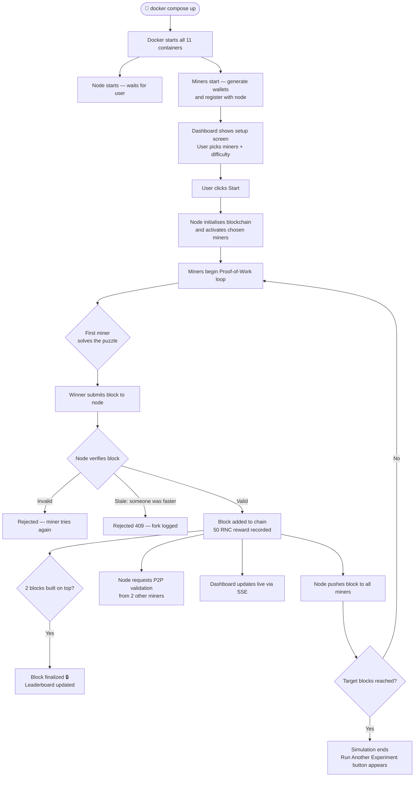
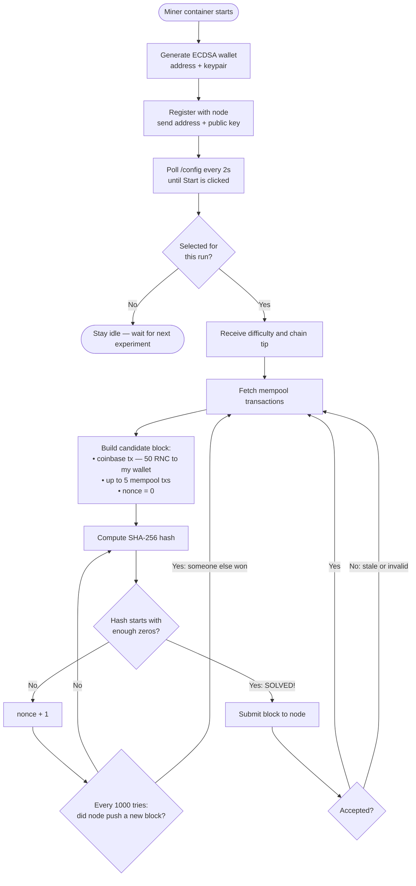
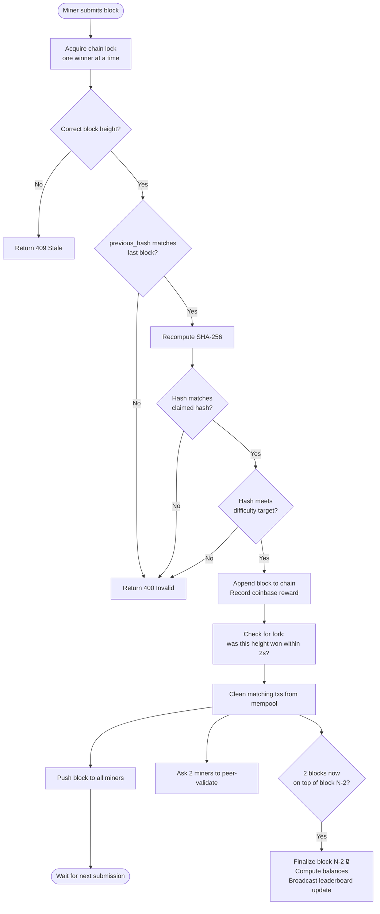

# ⛏️ CryptoSim — RennCoin Mining Simulation

A beginner-friendly simulation of how Bitcoin-style cryptocurrency actually works.
Up to 10 miners race each other to solve puzzles, earn **RennCoin (RNC)**, and build
a blockchain — all visible live in your browser.

> **No crypto experience needed.** If you can run `docker compose up`, you can run this.

---

## 📖 Table of Contents

1. [What is this?](#-what-is-this)
2. [The core idea — it's just a puzzle contest](#-the-core-idea--its-just-a-puzzle-contest)
3. [What's new — RennCoin features](#-whats-new--renncoin-features)
4. [How the simulation works](#-how-the-simulation-works)
5. [System architecture](#-system-architecture)
6. [Flowcharts](#-flowcharts)
7. [Project files](#-project-files)
8. [Quick start](#-quick-start)
9. [The live dashboard](#-the-live-dashboard)
10. [Configuration & tuning](#-configuration--tuning)
11. [Useful commands](#-useful-commands)
12. [Glossary](#-glossary)

---

## 🤔 What is this?

This project recreates the core mechanics of Bitcoin on your own computer using
Docker containers that talk to each other like real computers on the internet.

You configure the experiment through a webpage, hit **Start**, and watch up to 10 miners
race in real time. The winner of each round earns **RennCoin**, gets their name on the
leaderboard, and their block gets added to the chain. Once the target number of blocks is
mined, the simulation ends — and you can run another experiment with different settings
without restarting anything.

---

## 🧩 The core idea — it's just a puzzle contest

### Difficulty = how hard the puzzle is

Imagine a puzzle contest where everyone gets the same box of puzzle pieces at the same time
and races to finish first.

- **Difficulty 3** → a simple 10-piece puzzle. Anyone can finish in seconds.
- **Difficulty 4** → a 100-piece puzzle. Takes a minute or two.
- **Difficulty 5** → a 1,000-piece puzzle. Now we're talking real effort.
- **Difficulty 6** → a 10,000-piece puzzle. Takes a long time even for a fast computer.

In this simulation, "solving the puzzle" means finding a special number (called a **nonce**)
that, when combined with the block's data and run through a mathematical fingerprint
function (SHA-256), produces a result starting with a certain number of zeros:

```
SHA-256( block_data + nonce )  →  "0000a3f7c2..."  ✅  starts with 4 zeros — puzzle solved!
SHA-256( block_data + nonce )  →  "a3f7c20041..."  ❌  no leading zeros — keep trying
```

There is no shortcut. The only way to solve it is to **try billions of numbers** until one
works. This is called **Proof-of-Work**, and it's intentional — the effort makes cheating
expensive.

### Why the puzzle matters

Think of the blockchain as a public scoreboard locked in a glass case. To add a new line
to the scoreboard, you must first win the puzzle contest. This means:

- Anyone can *read* the scoreboard for free.
- Adding a *new entry* costs real computational work.
- Going *back and changing* an old entry means re-winning every contest from that point
  forward — faster than everyone else combined. Practically impossible.

That's what makes blockchain records trustworthy without needing a central authority.

### The chain

Each block contains the **fingerprint (hash) of the previous block**. Blocks are linked
like a chain of rings — pull one out and the whole chain from that point breaks:

```
[ Block #0 Genesis ] ← [ Block #1 ] ← [ Block #2 ] ← [ Block #3 ] ← ...
```

Tamper with Block #1 and its fingerprint changes. Block #2's stored fingerprint of Block #1
no longer matches. Block #3's stored fingerprint of Block #2 no longer matches. The entire
chain from that point is automatically invalidated.

---

## 🪙 What's new — RennCoin features

On top of the basic mining simulation, this project adds several real-world Bitcoin
mechanics:

### 1. Wallets & signed transactions
Every miner gets a **cryptographic wallet** when it starts — a unique key pair (like a
padlock and its key). The wallet has an **address** (like an account number).

When a miner wins a block, the reward isn't just a log message — it's a real
**RennCoin transaction** written into the block:
> *"Pay 50 RNC from COINBASE to miner_1's wallet address"*

Transactions between wallets are **digitally signed** — only the owner of a wallet can
authorise a transfer from it, just like only you can sign a cheque from your account.

### 2. Mempool — the waiting room
Not all transactions make it into a block right away. Pending transactions sit in the
**mempool** (memory pool) — a waiting room. Think of it like a queue at a post office.
When a miner wins the right to add a block, they pack the next few waiting transactions
into it, along with their own reward.

### 3. Fork detection — when two miners finish at the same time
Occasionally two miners solve the puzzle at almost exactly the same moment. This is called
a **fork** — like a road splitting in two. The simulation detects this, flags the
**orphaned chain** (the one that arrived a fraction of a second later), and shows a
warning banner on the dashboard.

### 4. Finality — locking blocks in
In Bitcoin, a transaction is considered truly safe after it has had **2 more blocks built
on top of it** (this simulation) or 6 in real Bitcoin. Think of it like wet concrete:
- Just poured → still soft, could be disrupted.
- 2 blocks later → hardened. Very safe.
- 6 blocks later → solid as rock.

Finalized blocks get a 🔒 lock icon on the dashboard.

### 5. P2P validation — miners check each other's work
After the node accepts a block, it secretly asks 2 other miners to independently verify it.
This simulates Bitcoin's decentralised approach where every participant checks every block —
no single authority is trusted blindly. Results appear in the activity log.

### 6. Leaderboard
A live leaderboard shows each miner's wallet address, RennCoin balance, and total blocks
won — updated every time a block is finalized.

### 7. Run another experiment
When a simulation finishes, a **"Run Another Experiment"** button appears. Click it and
the setup screen returns with a fresh configuration form — no need to restart Docker.

---

## 🔬 How the simulation works

| Real Bitcoin | This Simulation |
|---|---|
| Thousands of miners worldwide | Up to 10 Docker containers on your machine |
| Decentralised gossip protocol | Node pushes blocks to miners via HTTP |
| 10-minute block time target | Configurable — default a few seconds |
| Bitcoin (BTC) reward | RennCoin (RNC) — 50 per block |
| Runs forever | Stops after N blocks (configurable) |
| ECDSA on secp256k1 curve | Same — real cryptographic signatures |
| Mempool with fee priority | Mempool with randomly generated transfers |
| 6-confirmation finality | 2-confirmation finality |

---

## 🏗️ System architecture

There are **11 Docker containers** on a shared private network:

```
┌─────────────────────────────────────────────────────────────────────┐
│                      Docker Network: crypto_net                     │
│                                                                     │
│   ┌───────────────────────────────────────┐                         │
│   │               NODE  :8182             │  ← the authority        │
│   │                                       │                         │
│   │  • Owns the blockchain                │                         │
│   │  • Verifies submitted blocks          │                         │
│   │  • Manages wallets + balances         │                         │
│   │  • Detects forks                      │                         │
│   │  • Tracks mempool                     │                         │
│   │  • Serves the web dashboard           │                         │
│   │  • Streams live events to browser     │                         │
│   └───────┬──────────┬──────────┬─────────┘                         │
│           │ push     │ push     │ push (up to 10)                   │
│    ┌──────▼──┐ ┌─────▼───┐ ┌───▼─────┐   ┌─────────┐              │
│    │MINER 1  │ │MINER 2  │ │MINER 3  │...│MINER 10 │              │
│    │ :8183   │ │ :8184   │ │ :8185   │   │ :8192   │              │
│    │ wallet  │ │ wallet  │ │ wallet  │   │ wallet  │              │
│    │ mining  │ │ mining  │ │ mining  │   │ mining  │              │
│    └─────────┘ └─────────┘ └─────────┘   └─────────┘              │
│                                                                     │
└─────────────────────────────────────────────────────────────────────┘
         ▲
         │  Your browser connects here
    localhost:8182
```

**Key principle:** The node is the single source of truth. Miners do the computation;
the node decides what gets accepted.

---

## 📊 Flowcharts

### Overall simulation flow



---

### What a miner does



---

### What the node does when a block arrives



---

## 📁 Project files

```
crypto/
│
├── block.py           ← The Block data structure + SHA-256 hashing
├── blockchain.py      ← Blockchain rules: verification, finality, fork events, balances
├── transaction.py     ← RennCoin transaction types (coinbase reward + signed transfers)
├── wallet.py          ← ECDSA keypair wallet — same curve (secp256k1) as Bitcoin
├── node.py            ← Authority node: API, dashboard, mempool, fork detection
├── miner.py           ← Miner: wallet, PoW loop, P2P validation
│
├── Dockerfile         ← Single Docker image used by all 11 containers
├── docker-compose.yml ← Defines all 11 services and wires them together
├── requirements.txt   ← Python dependencies
└── README.md          ← This file
```

### `block.py`
A block is a container of data. Think of it like a page in an official ledger:

| Field | What it is |
|---|---|
| `index` | Page number. Genesis = 0. |
| `timestamp` | When the page was written. |
| `transactions` | The list of transfers recorded on this page. |
| `previous_hash` | The fingerprint of the previous page — this is what forms the chain. |
| `nonce` | The magic number the miner had to find to win the right to write this page. |
| `hash` | The fingerprint of this entire page. |

---

### `blockchain.py`
The rulebook. Before any block is accepted it checks four things:
1. Is it the next page in sequence? (no gaps)
2. Does it reference the correct previous page? (no broken links)
3. Does its fingerprint match its contents? (no tampering)
4. Did the miner actually do the work? (valid proof-of-work)

Also handles: tracking confirmed (finalized) blocks, computing balances, recording forks.

---

### `transaction.py`
Two types of transactions:
- **Coinbase** — created by the node when a block is won. No sender. Pays 50 RNC to the winning miner. Like the bank printing new coins and handing them to the winner.
- **Transfer** — a signed payment from one wallet to another. Like writing a cheque — only valid if the signature matches the sender's key.

---

### `wallet.py`
Every miner has a wallet with:
- A **private key** — secret, used to sign transactions. Like your PIN.
- A **public key** — shareable, used by others to verify your signature. Like your signature on a cheque.
- An **address** — a short fingerprint of your public key. Like your account number.

Uses the same **secp256k1 elliptic curve** that Bitcoin uses.

---

### `node.py`
The central authority. Runs a web server with these endpoints:

| Endpoint | What it does |
|---|---|
| `GET /` | Serves the dashboard webpage |
| `GET /events` | Streams live updates to your browser (SSE) |
| `POST /register` | Miner check-in — receives wallet address |
| `GET /config` | Miners poll this waiting for Start to be clicked |
| `POST /start` | User clicks Start — sets difficulty and active miners |
| `POST /submit_block` | Miner submits a solved block |
| `GET /mempool` | Returns pending transactions |
| `GET /balances` | Returns RNC balances and wallet addresses |
| `POST /reset` | User clicks "Run Another Experiment" |

---

### `miner.py`
Each miner runs two things simultaneously:
1. **A web server** — listens for blocks pushed by the node, shutdown signals, and peer-validation requests.
2. **A background mining thread** — the tight puzzle-solving loop. Runs separately so the web server stays responsive even while crunching numbers.

---

## 🚀 Quick start

### Prerequisites
- [Docker Desktop](https://www.docker.com/products/docker-desktop/) installed and running
- That's it — no Python needed on your machine

### Steps

```bash
# 1. Go into the project folder
cd crypto

# 2. Build the Docker image and start all containers
docker compose up --build

# 3. Open the dashboard in your browser
#    http://localhost:8182

# 4. Pick how many miners and how hard the puzzle should be, then click Start

# 5. When you're done
docker compose down
```

---

## 🖥️ The live dashboard

Open **http://localhost:8182** after starting.

**Setup screen** — shown before the simulation starts:
- Choose how many miners should participate (1–10)
- Choose the difficulty (3–6)
- Watch the miner count tick up as containers register
- Hit **Start** when ready

**Dashboard** — shown during and after the simulation:
- **Stats bar** — chain length, blocks mined, active miners, difficulty, target, mempool size
- **Fork banner** — flashes if two miners solve the same block simultaneously
- **Activity log** — every event streams here live (block accepted, P2P checks, forks, finality)
- **Chain panel** — each new block appears at the top; finalized blocks get a 🔒
- **Leaderboard** — ranks miners by RNC balance, showing wallet address and blocks won
- **Run Another Experiment** — appears when done; resets the simulation without restarting Docker

---

## ⚙️ Configuration & tuning

| Variable | Default | What it controls |
|---|---|---|
| `NUM_BLOCKS` | `10` | How many blocks to mine before the simulation ends |

Difficulty and miner count are set live on the dashboard before each run.

### Difficulty guide

| Difficulty | Puzzle size analogy | Approx. time per block |
|---|---|---|
| `3` | 10-piece puzzle | Under a second |
| `4` | 100-piece puzzle | 1–10 seconds |
| `5` | 1,000-piece puzzle | 15–90 seconds |
| `6` | 10,000-piece puzzle | Several minutes |

> **Why the range?** SHA-256 is like rolling dice — sometimes you find the answer on the
> first few tries, sometimes it takes much longer. This randomness is a feature, not a bug.
> Real Bitcoin uses it to ensure blocks appear roughly every 10 minutes on average.

---

## 🛠️ Useful commands

```bash
# Start everything (rebuilds the image if files changed)
docker compose up --build

# Start in the background
docker compose up --build -d

# Watch live logs from all containers
docker compose logs --follow

# Watch logs from just the node
docker compose logs node --follow

# Stop everything
docker compose down

# Full clean — remove containers and the built image
docker compose down --rmi all

# Check the full blockchain as JSON
curl http://localhost:8182/chain

# Check current RNC balances
curl http://localhost:8182/balances

# Check the mempool
curl http://localhost:8182/mempool

# Restart just the node (e.g. after a code change copied in)
docker cp node.py crypto-node-1:/app/node.py && docker restart crypto-node-1
```

---

## 📚 Glossary

| Term | Plain-English explanation |
|---|---|
| **Block** | A bundle of transactions + metadata. Like a page in a public ledger. |
| **Blockchain** | A list of blocks where each one references the one before it. Tamper-evident. |
| **Genesis block** | Block #0 — the hard-coded starting point of every blockchain. |
| **Hash / fingerprint** | A fixed-length summary of some data. Change even one character in the input and the hash changes completely. |
| **SHA-256** | The specific hash function used here and in Bitcoin. Always produces a 64-character hex string. |
| **Nonce** | "Number used once." The value miners keep changing until the hash meets the target. |
| **Proof-of-Work** | The puzzle miners must solve. Proves they spent real computational effort. |
| **Difficulty** | How hard the puzzle is. Higher = hash must start with more zeros. |
| **Mining** | Searching for a nonce that makes the hash meet the difficulty target. |
| **Chain tip** | The most recently added block. Miners always build on top of this. |
| **RennCoin (RNC)** | The simulated cryptocurrency. 50 RNC is paid to the miner who wins each block. |
| **Coinbase transaction** | The reward transaction in every block. No sender — new coins come from nowhere, like a mint printing money. |
| **Wallet** | A cryptographic key pair. Private key = PIN, public key = signature, address = account number. |
| **ECDSA** | Elliptic Curve Digital Signature Algorithm — the maths behind signing transactions. Same curve as Bitcoin. |
| **Mempool** | Memory pool — a waiting room for transactions not yet included in a block. |
| **Fork** | When two miners solve the same height simultaneously. One block wins, the other is orphaned. |
| **Finality** | A block is "final" (safe) when 2 more blocks have been built on top of it. Like concrete setting. |
| **P2P validation** | After a block is accepted, 2 other miners independently verify it — no single point of trust. |
| **SSE** | Server-Sent Events — how the server pushes live updates to your browser without refreshing. |
| **Docker** | Software that packages an app and all its dependencies into an isolated container. |
| **Docker Compose** | A tool to run multiple containers together as one application. |
| **Stale block** | A solved block that arrived after another miner already won the same height. Rejected. |
