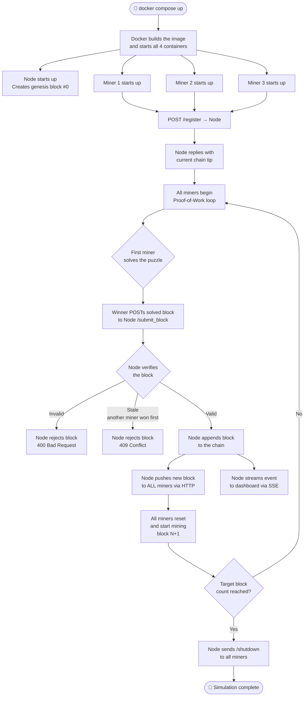
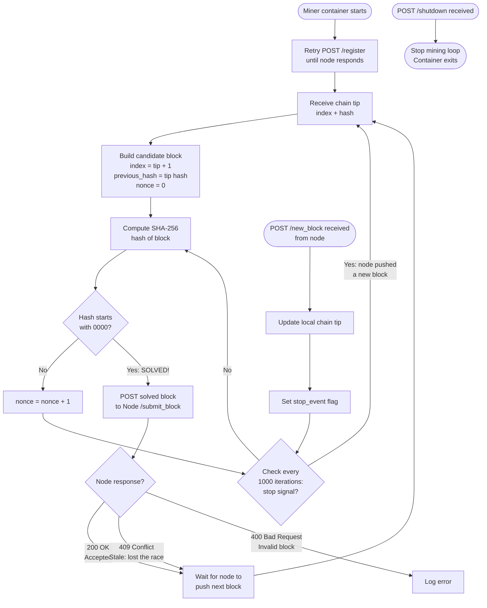
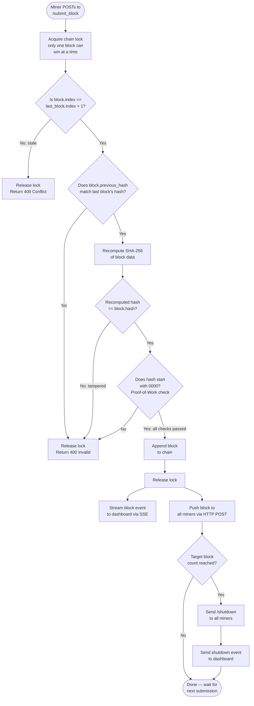

# ⛏️ CryptoSim — Bitcoin-Style Mining Simulation

A fully containerised, beginner-friendly simulation of how Bitcoin mining actually works.
Three miners race each other to solve a mathematical puzzle. The first one to solve it wins
the right to add the next block to the blockchain. Watch it all happen live in your browser.

> **No crypto experience needed.** If you can run `docker compose up`, you can run this.

---

## 📖 Table of Contents

1. [What is this?](#-what-is-this)
2. [How does Bitcoin mining actually work?](#-how-does-bitcoin-mining-actually-work)
3. [How this simulation works](#-how-this-simulation-works)
4. [System architecture](#-system-architecture)
5. [Flowcharts](#-flowcharts)
   - [Overall simulation flow](#overall-simulation-flow)
   - [What a miner does](#what-a-miner-does)
   - [What the node does when a block is submitted](#what-the-node-does-when-a-block-is-submitted)
6. [Project file structure](#-project-file-structure)
7. [File responsibilities](#-file-responsibilities)
8. [Quick start](#-quick-start)
9. [The live dashboard](#-the-live-dashboard)
10. [Configuration & tuning](#-configuration--tuning)
11. [Adding more miners](#-adding-more-miners)
12. [Useful commands](#-useful-commands)
13. [Glossary](#-glossary)

---

## 🤔 What is this?

This project simulates the core mechanics of Bitcoin at a simplified level using:

- **Docker containers** — each container is like an independent computer on the internet
- **Python + FastAPI** — lightweight web servers inside each container
- **SHA-256 hashing** — the same algorithm Bitcoin uses
- **Proof-of-Work** — the mathematical puzzle miners must solve
- **A live web dashboard** — so you can watch everything happen in real time

Think of it like a race. Multiple miners are simultaneously trying to solve the same puzzle.
The fastest one wins, adds a block to the chain, and everyone else abandons their current
attempt and starts fresh on the next puzzle.

---

## 🪙 How does Bitcoin mining actually work?

Before looking at the code, here's the concept in plain English:

### The puzzle

Bitcoin asks miners to find a number (called a **nonce**) such that when you combine it with
the block's data and run it through a hash function, the result starts with a certain number
of zeros.

```
SHA-256( block_data + nonce )  →  "0000a3f7c2..." ✅  (starts with 4 zeros = valid!)
SHA-256( block_data + nonce )  →  "a3f7c20041..." ❌  (doesn't start with zeros = try again)
```

### Why is this hard?

SHA-256 is a one-way function — you cannot work backwards from the result to find the input.
The only way to find a valid nonce is to **try billions of numbers** until one works.
This is called **brute-force search**, and it's intentionally expensive in time and energy.

### Why bother?

The difficulty ensures that adding a block takes real effort. This prevents anyone from
fraudulently rewriting history, because they would have to redo all that computational
work — faster than the entire rest of the network combined.

### The chain

Each block contains the **hash of the previous block**. This creates a chain:

```
[ Genesis Block ] ← [ Block #1 ] ← [ Block #2 ] ← [ Block #3 ] ← ...
```

If you tamper with Block #1, its hash changes. That breaks Block #2's link.
That breaks Block #3's link. The entire chain from that point forward is invalidated.
This is what makes the blockchain **tamper-evident**.

---

## 🔬 How this simulation works

This project recreates those mechanics using Docker containers talking to each other over HTTP:

| Real Bitcoin | This Simulation |
|---|---|
| Thousands of miners worldwide | 3 Docker containers on your machine |
| Gossip protocol (peer-to-peer) | Node pushes blocks directly to each miner (HTTP POST) |
| 10-minute block time target | Configurable — default ~1–10 seconds |
| Real monetary reward | Just a log message saying who won 🏆 |
| Runs forever | Stops after N blocks (configurable) |
| SHA-256d (double hash) | Single SHA-256 (simplified) |

---

## 🏗️ System architecture

There are **4 Docker containers** running on a shared private network:

```
┌─────────────────────────────────────────────────────────────┐
│                    Docker Network: crypto_net               │
│                                                             │
│   ┌─────────────────────────────────┐                       │
│   │           NODE                  │  ← the authority      │
│   │        :8182                    │                       │
│   │  • Owns the blockchain          │                       │
│   │  • Verifies submitted blocks    │                       │
│   │  • Pushes accepted blocks to    │                       │
│   │    all miners                   │                       │
│   │  • Serves the web dashboard     │                       │
│   │  • Streams live SSE events      │                       │
│   └──────┬────────────┬─────────────┘                       │
│          │ push       │ push                                 │
│     ┌────▼───┐   ┌────▼───┐   ┌─────────┐                  │
│     │MINER 1 │   │MINER 2 │   │ MINER 3 │                  │
│     │ :8001  │   │ :8002  │   │  :8003  │                  │
│     │ mining │   │ mining │   │  mining │                  │
│     └────────┘   └────────┘   └─────────┘                  │
│                                                             │
└─────────────────────────────────────────────────────────────┘
         ▲
         │  Your browser connects here
    localhost:8182
```

**Key principle:** The node is the single source of truth. Miners do the computation;
the node decides what gets accepted.

---

## 📊 Flowcharts

### Overall simulation flow



---

### What a miner does



---

### What the node does when a block is submitted



---

## 📁 Project file structure

```
crypto/
│
├── block.py            ← The Block data structure + SHA-256 hashing
├── blockchain.py       ← The Blockchain class (verification + chain management)
├── node.py             ← The authority node (FastAPI app + SSE dashboard)
├── miner.py            ← The miner (FastAPI app + background PoW thread)
│
├── Dockerfile          ← Single Docker image used by all 4 containers
├── docker-compose.yml  ← Defines and wires together all 4 services
├── requirements.txt    ← Python dependencies (fastapi, uvicorn, httpx)
│
├── .gitignore          ← Files to never commit to git
└── README.md           ← This file
```

---

## 📄 File responsibilities

### `block.py` — The Block

A block is just a Python dataclass (a named container of data):

| Field | Type | Description |
|---|---|---|
| `index` | int | Position in the chain. Genesis = 0, next = 1, etc. |
| `timestamp` | float | Unix time when the block was created |
| `transactions` | list[str] | Simplified: plain-text strings representing transactions |
| `previous_hash` | str | SHA-256 hash of the block that comes before this one |
| `nonce` | int | The number miners iterate over to solve the puzzle |
| `hash` | str | SHA-256 hash of all the above fields combined |

**Key method:** `compute_hash()` — serialises the block to JSON and returns its SHA-256 hex digest.

---

### `blockchain.py` — The Chain

Holds a list of Blocks and enforces the rules:

- **`__init__`** — creates the genesis block automatically
- **`verify_block(block)`** — checks 4 things before accepting any block:
  1. Index is exactly `last_block.index + 1` (no gaps)
  2. `previous_hash` matches the actual last block's hash (no chain breaks)
  3. Recomputed hash matches the claimed hash (no tampering)
  4. Hash starts with the required number of zeros (valid proof-of-work)
- **`append_block(block)`** — adds a verified block to the chain

---

### `node.py` — The Authority Node

This is the most complex file. It runs a FastAPI web server with these endpoints:

| Endpoint | Method | Who calls it | What it does |
|---|---|---|---|
| `/` | GET | Your browser | Serves the live dashboard HTML page |
| `/events` | GET | Your browser | Streams live events via SSE (Server-Sent Events) |
| `/register` | POST | Miners | Registers a miner and returns the current chain tip |
| `/submit_block` | POST | Miners | Verifies + accepts/rejects a solved block |
| `/chain` | GET | You / debugging | Returns the full chain as JSON |

**Server-Sent Events (SSE)** is a web technology that keeps a connection open from the
server to the browser, allowing the server to push updates in real time without the browser
needing to refresh or poll.

---

### `miner.py` — The Miner

Each miner container runs this file. It has two parts running simultaneously:

1. **FastAPI HTTP server** (async, event-loop thread):
   - `POST /new_block` — receives a pushed block from the node, updates the tip
   - `POST /shutdown` — stops the mining loop permanently
   - `GET /health` — returns current status (useful for debugging)

2. **Background mining thread** (separate OS thread):
   - The tight nonce-incrementing loop runs here
   - Cannot run in the async event loop because it would freeze the HTTP server
   - Checks a `stop_event` flag every 1,000 iterations to stay responsive to pushes

---

### `Dockerfile` — The Container Image

Both the node and miners use the same Docker image (based on Python 3.11).
The `command:` line in `docker-compose.yml` tells each container which app to run:
- Node runs: `uvicorn node:app`
- Each miner runs: `uvicorn miner:app`

---

### `docker-compose.yml` — The Orchestrator

Defines all 4 services, their environment variables, port mappings, and the shared
Docker network (`crypto_net`) that lets them communicate using service names instead of
IP addresses (e.g. `http://node:8182` instead of `http://172.18.0.2:8182`).

---

## 🚀 Quick start

### Prerequisites

- [Docker Desktop](https://www.docker.com/products/docker-desktop/) installed and running
- That's it — no Python installation needed on your machine

### Steps

```bash
# 1. Clone or download this project
cd crypto

# 2. Build the Docker image and start all 4 containers
docker compose up --build

# 3. Open the live dashboard in your browser
#    http://localhost:8182

# 4. When you're done, stop everything
docker compose down
```

You should see output like this in your terminal:

```
node      | [NODE] INFO  Genesis block created
node      | [NODE] INFO  Miner registered: miner_1 @ http://miner_1:8001
miner_1   | [MINER_1] INFO  Starting PoW for block #1
miner_2   | [MINER_2] INFO  Starting PoW for block #1
miner_1   | [MINER_1] INFO  SOLVED block #1  nonce=48291  hash=0000a3f7c2...  (2.41 s)
node      | [NODE] INFO  Block #1 ACCEPTED  |  miner=miner_1  nonce=48291  time=2.41s
miner_2   | [MINER_2] INFO  Block #1 mining interrupted — node received block from another miner
```

---

## 🖥️ The live dashboard

Open **http://localhost:8182** after starting the simulation.

```
┌─────────────────────────────────────────────────────────────────┐
│  ⛏ CryptoSim  [MINING]                                          │
│  difficulty: 0000 — target: 10 blocks                           │
│                                                                 │
│  Chain Length: 4   Blocks Mined: 3   Active Miners: 3           │
│  Difficulty: 4     Target Blocks: 10                            │
│                                                                 │
│  ┌──────────────────────────┐  ┌──────────────────────────┐    │
│  │ Event Log                │  │ Chain                    │    │
│  │                          │  │                          │    │
│  │ [10:23:01] miner_1 reg.. │  │ #3  0000c4a1...  miner_2 │    │
│  │ [10:23:01] miner_2 reg.. │  │ #2  00007f3b...  miner_1 │    │
│  │ [10:23:03] Block #1 ACC  │  │ #1  0000a3f7...  miner_1 │    │
│  │ [10:23:06] Block #2 ACC  │  │ #0  Genesis Block        │    │
│  │ ...                      │  │                          │    │
│  └──────────────────────────┘  └──────────────────────────┘    │
└─────────────────────────────────────────────────────────────────┘
```

- **Event Log** — every significant event streams here in real time (no page refresh needed)
- **Chain panel** — each accepted block appears at the top as it's added
- **Colour coding** — each miner gets its own colour so you can see who's winning
- When the simulation finishes, the badge changes from `MINING` to `DONE`

---

## ⚙️ Configuration & tuning

All settings live in the `environment:` section of `docker-compose.yml` under the `node` service:

| Variable | Default | Effect |
|---|---|---|
| `DIFFICULTY` | `4` | How many leading zeros the hash must have |
| `NUM_BLOCKS` | `10` | How many blocks before the simulation ends |

### Difficulty guide

| Difficulty | Leading zeros | Approx. time per block | Good for |
|---|---|---|---|
| `3` | `000...` | 0.05 – 0.5 s | Quick smoke test |
| `4` | `0000...` | 1 – 10 s | **Default — good for watching live** |
| `5` | `00000...` | 15 – 90 s | Feels closer to real mining |
| `6` | `000000...` | Several minutes | Stress test |

> **Why the range?** SHA-256 is random — sometimes you get lucky and find a valid nonce
> quickly; sometimes it takes much longer. This is exactly how real Bitcoin works.

---

## ➕ Adding more miners

To add a 4th miner, copy the `miner_3` block in `docker-compose.yml` and change
three things:

```yaml
  miner_4:                                          # ← new service name
    build: .
    command: uvicorn miner:app --host 0.0.0.0 --port 8004 --log-level warning
    ports:
      - "8004:8004"                                 # ← new port
    environment:
      NODE_URL:   http://node:8182
      MINER_ID:   miner_4                           # ← new ID
      MINER_URL:  http://miner_4:8004               # ← new callback URL
      DIFFICULTY: 4
    networks:
      - crypto_net
    depends_on:
      - node
```

That's all — no code changes needed. The node discovers miners dynamically when they register.

---

## 🛠️ Useful commands

```bash
# Start the simulation (rebuild image if files changed)
docker compose up --build

# Start in the background (detached mode)
docker compose up --build -d

# Watch logs for a specific container
docker compose logs node --follow
docker compose logs miner_1 --follow

# Watch all container logs at once with colour per service
docker compose logs --follow

# Stop all containers (keeps the built image)
docker compose down

# Stop and remove the built image too (full clean)
docker compose down --rmi all

# Check the full chain JSON (while running)
curl http://localhost:8182/chain

# Check a miner's health (while running)
curl http://localhost:8001/health
curl http://localhost:8002/health
curl http://localhost:8003/health

# Restart just one container without rebuilding
docker compose restart miner_2
```

---

## 📚 Glossary

| Term | Plain-English explanation |
|---|---|
| **Block** | A bundle of transactions + metadata. Like a page in a ledger. |
| **Blockchain** | A list of blocks where each one references the one before it. Tamper-evident. |
| **Genesis block** | Block #0. The hard-coded starting point of every blockchain. |
| **Hash** | A fixed-length fingerprint of some data, produced by a mathematical function. Changing even one character in the input produces a completely different hash. |
| **SHA-256** | The specific hash function used by Bitcoin (and this simulation). Always produces a 64-character hex string. |
| **Nonce** | "Number used once." The value miners iterate over when searching for a valid hash. |
| **Proof-of-Work (PoW)** | The puzzle miners solve. Proves they spent real computational effort. |
| **Difficulty** | How hard the puzzle is. Higher difficulty = hash must start with more zeros = harder. |
| **Mining** | The process of searching for a nonce that produces a hash meeting the difficulty target. |
| **Chain tip** | The most recently added block. Miners always build on top of this. |
| **previous_hash** | The hash of the preceding block, stored inside the current block. This is what "chains" the blocks together. |
| **SSE** | Server-Sent Events. A web standard for the server to push data to the browser over a persistent HTTP connection. |
| **FastAPI** | A Python web framework for building HTTP APIs quickly. |
| **uvicorn** | The ASGI server that runs FastAPI apps. Handles the actual TCP connections. |
| **Docker** | Software that packages an application and all its dependencies into an isolated "container." |
| **Docker Compose** | A tool to define and run multiple Docker containers together. |
| **Bridge network** | A private Docker network. Containers on it can reach each other by service name. |
| **Stale block** | A solved block that arrived at the node after another miner already won the same block height. Rejected with 409. |
| **ASGI** | Async Server Gateway Interface. The protocol FastAPI uses to handle concurrent requests. |
